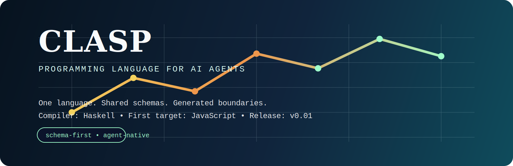
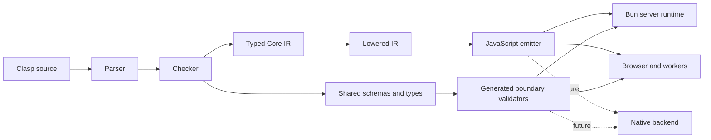

<p align="center">
  
</p>

<p align="center">
  
  
  
  
  
  
</p>

# Clasp

`Clasp` is an experimental attempt at the first programming language designed from the ground up for AI agents.

It is trying to make one idea real:

- one semantic layer across frontend, backend, workers, and eventually apps
- one shared type and schema system everywhere
- generated validation at trust boundaries
- a language surface optimized for agent reasoning, repair, and change propagation

Long term, `Clasp` is not trying to replace every low-level substrate. The aim is to become the default system language for most software-building agents while letting JavaScript, native code, databases, and provider SDKs live behind typed, auditable boundaries when that is the more practical choice.

This repository is the public `v0.01` release.

> [!IMPORTANT]
> `Clasp v0.01` is a research prototype.
> It is very early, incomplete, and not production-ready.
> The purpose of this repo is to test whether an AI-first language can produce measurable harness-level gains, not to claim that the language is already finished.

## Why This Exists

Modern agents spend too much effort dealing with:

- duplicated types across frontend and backend
- weak or manual validation at boundaries
- fragile stringly-typed LLM and tool interfaces
- large, noisy code surfaces
- change propagation across multiple stacks and runtimes

`Clasp` is an attempt to reduce that burden by making schemas, types, boundaries, and workflows part of the language itself.

The long-term goal is not “shorter syntax.”

The goal is:

- less fresh reasoning per task
- fewer repair loops
- fewer human interventions
- more correctness caught before runtime

## What Is In `v0.01`

This repo already includes a working compiler scaffold and benchmark harness.

Current implementation highlights:

- parser, checker, diagnostics, typed core IR, and lowered backend IR
- algebraic data types and exhaustive match checking
- records as first schema-bearing product types
- local type inference
- multi-file imports
- foreign runtime bindings
- typed HTTP routes
- generated JSON decode/encode validation for supported boundary types
- JavaScript emission
- Bun-backed demo runtime for route serving

## Architecture



## Early Benchmark Signal

The first benchmark family is intentionally narrow:

- shared schema change
- typed HTTP boundary
- mock LLM/model boundary
- zero human intervention

On the latest `Codex` run using `gpt-5.4`, after making the benchmark workspace self-describing so the agent did not need to inspect the parent compiler/docs:

| Task | Harness | Model | Duration | Total Tokens | Uncached Tokens | Result |
| --- | --- | --- | ---: | ---: | ---: | --- |
| `Clasp` lead-priority | `Codex` | `gpt-5.4` | `33.245s` | `76,023` | `8,183` | pass |
| `TypeScript` lead-priority | `Codex` | `gpt-5.4` | `35.587s` | `65,620` | `10,324` | pass |

On that run:

- `Clasp` was `6.6%` faster
- `Clasp` used `20.7%` fewer uncached tokens
- `Clasp` used more total tokens because cached context was larger

> [!NOTE]
> This is a promising early signal, not a broad claim that `Clasp` is already better than TypeScript.
> It is one benchmark family, one harness, and one model, on a task that matches the language thesis.

Benchmark artifacts:

- [benchmark snapshot](docs/clasp-benchmark-snapshot-v0.01.md)
- [benchmark plan](docs/clasp-benchmark-plan.md)

## What Clasp Is Trying To Prove

`Clasp` is only worth building if it can show measurable harness-level gains on real tasks.

The bar is not “interesting language design.”

The bar is:

- agents finish more tasks without intervention
- agents use fewer uncached tokens to get to green
- shared schema changes propagate more cleanly
- boundary failures are caught automatically
- one codebase can span more of the stack
- Clasp can act as the primary semantic layer of a real system without forcing every specialized component to be rewritten in Clasp first

If that does not hold up across more tasks and more harnesses, the project should be reconsidered.

## Repository Layout

- `docs/ai-native-universal-language.md`: long-term design goals
- `docs/clasp-spec-v0.md`: current language spec
- `docs/clasp-roadmap.md`: implementation roadmap
- `docs/clasp-benchmark-plan.md`: benchmark strategy
- `benchmarks/`: benchmark repos, manifests, runner, and results
- `src/Clasp/`: compiler implementation
- `runtime/bun/`: Bun runtime helpers
- `examples/`: small example programs and demo app
- `app/Main.hs`: `claspc` CLI entrypoint

## Quick Start

```sh
nix develop
cabal build
cabal test

cabal run claspc -- check examples/hello.clasp
cabal run claspc -- check examples/status.clasp
cabal run claspc -- check examples/records.clasp
cabal run claspc -- check examples/lead-app/Main.clasp

cabal run claspc -- compile examples/lead-app/Main.clasp -o examples/lead-app/Main.js
bun examples/lead-app/server.mjs
```

## Near-Term Direction

The immediate priorities are:

- stronger schemas and boundary typing
- a first credible benchmark on a moderate SaaS slice rather than more toy compiler-only wins
- more realistic full-stack benchmark tasks
- more benchmark repetitions and more harnesses
- frontend/app model evolution
- better agent-oriented diagnostics and tooling

## If This Works

If `Clasp` works, the outcome is not just “another language.”

It would mean:

- a full-stack language shaped for agent workflows instead of human-only ergonomics
- a codebase where shared types and generated boundaries remove entire classes of glue code
- an environment where agents spend less effort navigating mismatched schemas and more effort solving product problems
- a plausible default language for most software-building agents, even when specialized runtimes remain behind typed boundaries
